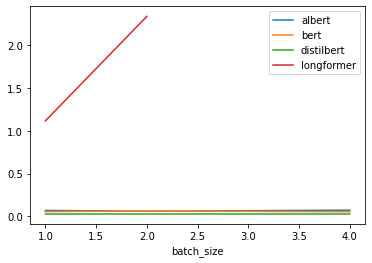
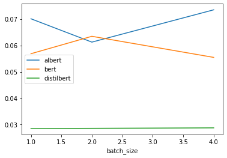
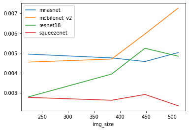
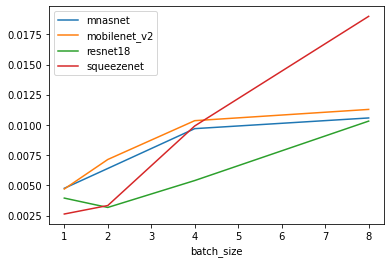

NoName:
---
Patrick Fernandes, Jared Fernandez, Haoming Zhang, Hao Zhu

1: Models
----
* BERT
* AlBERT
* DistilBERT
* Longformer
* mobilenet_V2
* resnet18
* squeezenet
* vgg16

Based on the model properties, we made the following hypothesis

 1. We assume that for both vision and language models, the latency for each batch is proportional to the batch size.
 2. We assume that for vision models, the latency for each batch is proportional to number of pixels for each image, i.e., proportional to square of batch size.
 3. We assume that for transformers models, the latency for each batch is proportional to sequence lengths, except the Longformer, whose latency will be constant with varying sequence lengths according to its paper. 

2: Parameter count
----

* AlBERT: 11.7M
* BERT: 109.5M
* distilBERT: 66.4M
* longformer: 148.7M
* mnasnet: 4.4M
* mobilenet_v2: 3.5M
* resnet18: 11.7M
* squeezenet: 1.2M

No difficulties were found when computing total parameters

3: Latency
----

Latency while varying image size and batch size for computer vision models is plotted below.

Latency while varying image size and batch size for natural langugage / transformer models is plotted below. 
Since Longformer was major outlier, we also plot latency vs batch size without it.

The main problem came from the memory requirments for transformer models.
 We suspect that, for example, the latency of longformer is due to swap usage and we can see that we cannot even run it for batch size > 2. 
Other transformers run out of space at batch size > 4.

4: Discussion
----

 * The results from section 3 are consistent with hypothesis 2 and 3. 
 * For hypothesis 1, the results for vision models align with our hypothesis. However, the latency for AlBERT, BERT and DistillBERT seems to be constant with varying batch sizes. One possible explanation could be that there are some other bottlenecks during the computations with takes longer time than matrix multiplications since our devices can only support relatively small batch size. To verify our assumption, we will run the experiments on GPU servers with larger batch sizes in next section. 

5: Extra
----

### Server Data

For comparison against high-performance systems we ran the same benchmarks on a deep learning server with an Intel Xeon W-2295 CPU and an Nvidia RTX-8000 GPU (48 GB VRAM) with 128 GB of RAM.

Latency while varying image size and batch size for computer vision models is plotted below.

Latency while varying image size and batch size for natural langugage / transformer models is plotted below. 

We can see that results on the server are mostly the same as for the Jetson.
This includes the constant latency per batch size. This again hints that there is a bottleneck that isn't more expensive even when the batch size is bigger.
